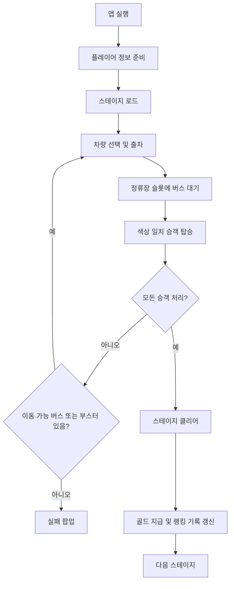
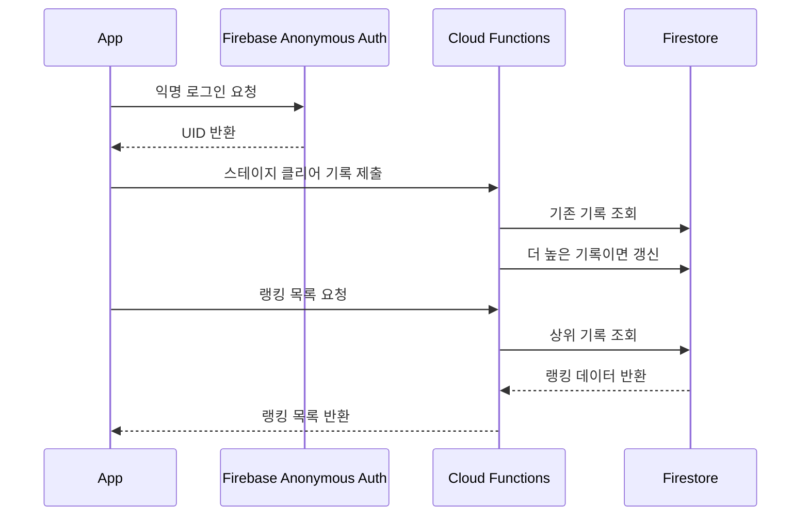

# BusPop 게임 기획서

작성일: 2026-06-21  
문서 목적: 개발 정리, 운영 기준, 포트폴리오 설명 자료

## 1. 프로젝트 개요

BusPop은 제한된 주차 공간에서 버스를 올바른 순서로 출차시키고, 같은 색상의 승객을 정류장에 태워 보내는 모바일 퍼즐 게임이다. 플레이어는 차량의 방향, 이동 경로, 정류장 슬롯, 승객 색상 흐름을 함께 판단해야 하며, 짧은 플레이 시간 안에서 명확한 성공과 실패를 경험하도록 설계한다.

핵심 목표는 복잡한 조작 없이도 퍼즐 판단의 재미가 드러나는 것이다. 한 손으로 빠르게 플레이할 수 있고, 스테이지가 진행될수록 차량 배치와 승객 흐름이 조금씩 어려워지는 구조를 지향한다.

## 2. 핵심 컨셉

| 항목 | 내용 |
| --- | --- |
| 장르 | 캐주얼 퍼즐 |
| 플랫폼 | Android, iOS |
| 주요 조작 | 차량 탭, 부스터 버튼, 정류장 슬롯 해금 |
| 플레이 목표 | 모든 승객을 올바른 버스에 태워 스테이지 클리어 |
| 세션 길이 | 짧은 반복 플레이 중심 |
| 수익화 | 보상형 광고, 배너 광고, 광고 대체 티켓 |
| 성장 동기 | 스테이지 진행, 최고 기록 랭킹, 일일 보상 |

## 3. 플레이 경험 목표

- 플레이어는 화면을 보자마자 어떤 버스를 보낼 수 있는지 직관적으로 파악할 수 있어야 한다.
- 실패는 갑작스럽게 느껴지기보다 “정류장 슬롯과 버스 순서를 잘못 선택했다”는 원인이 보이도록 한다.
- 광고는 강제 흐름이 아니라, 추가 슬롯 해금이나 부스터 사용처럼 플레이어가 선택하는 보상 구조로 제공한다.
- 랭킹은 경쟁 압박보다 “다른 플레이어가 어디까지 갔는지”를 보여주는 도전 동기 역할을 한다.
- UI는 게임의 밝고 캐주얼한 분위기에 맞추되, 팝업과 글자는 피로감이 적도록 정돈한다.

## 4. 핵심 게임 루프

## 5. 게임 규칙

### 5.1 차량 이동

차량은 각자 정해진 방향을 가진다. 플레이어가 차량을 탭하면 해당 방향으로 이동을 시도한다.

- 이동 경로가 막혀 있으면 차량은 충돌 피드백 후 원래 위치로 돌아간다.
- 이동 경로가 열려 있으면 차량은 주차장을 빠져나와 정류장 슬롯으로 이동한다.
- 정류장 슬롯이 가득 차면 추가 차량을 보낼 수 없으며, 상황에 따라 실패가 발생한다.

### 5.2 승객과 버스

승객은 상단 로터리에서 색상 그룹으로 대기한다. 정류장에 도착한 버스 색상과 승객 색상이 일치하면 승객이 탑승한다.

| 버스 크기 | 수용 인원 | 승객 유닛 기준 |
| --- | ---: | ---: |
| Small | 16명 | 4유닛 |
| Medium | 28명 | 7유닛 |
| Large | 40명 | 10유닛 |

승객 1유닛은 4명의 승객을 의미한다. 이 방식은 화면에 너무 많은 개별 승객을 표시하지 않으면서도 인원 규모감을 유지하기 위한 표현 방식이다.

### 5.3 정류장 슬롯

정류장은 기본 슬롯과 해금 슬롯으로 구성된다.

- 기본 활성 슬롯: 4개
- 추가 해금 슬롯: 4개
- 추가 슬롯은 광고 시청 또는 광고 스킵 티켓으로 해금할 수 있다.
- VIP 슬롯은 별도 시각 요소로 구분해, 특수 기능 영역임을 명확히 보여준다.

## 6. 스테이지 구조

스테이지는 미리 생성된 레벨 시퀀스를 우선 사용한다. 런타임 자동 생성은 예외 상황에서만 동작하는 보조 흐름이다.

- 기본 레벨 데이터는 `Resources/Levels/Generated/GeneratedLevelSequence.asset`에서 로드한다.
- 스테이지 진행 정보는 로컬에 저장한다.
- 이전 스테이지 선택 기능은 제공하지 않는다.
- 플레이어는 현재 진행 중인 스테이지를 이어서 플레이한다.

이 구조는 조작을 단순하게 유지하고, 랭킹 기록도 “최고 클리어 스테이지” 기준으로 명확하게 관리하기 위한 선택이다.

## 7. 난이도 설계

난이도는 차량 수, 색상 구성, 버스 크기, 승객 색상 흐름, 정류장 슬롯 압박으로 조절한다.

- 초반부는 기본 규칙을 익히는 데 집중한다.
- 중반부부터 색상 대기열과 차량 배치 판단을 강화한다.
- 후반부는 정류장 슬롯 관리와 부스터 사용 판단이 중요해진다.
- 스테이지 50 이후에도 이어질 수 있도록 생성 기반을 확장한다.

## 8. 튜토리얼

튜토리얼은 별도 긴 설명 화면이 아니라, 실제 게임 화면 위에서 단계별 안내로 진행된다.

주요 안내 흐름:

1. 첫 번째 버스 탭
2. 출차 및 정류장 대기 이해
3. 두 번째 버스 탭
4. 빠른 진행 기능 안내
5. 추가 슬롯 기능 안내
6. 믹스 기능 안내
7. 디퍼트 기능 안내
8. VIP 기능 안내

튜토리얼은 첫 플레이의 진입 장벽을 낮추는 역할이며, 이후에는 일반 플레이 흐름을 방해하지 않는다.

## 9. 재화와 아이템

### 9.1 골드

골드는 스테이지 클리어 및 일일 보상으로 획득한다. 부스터 사용 비용으로 소비된다.

| 항목 | 기본 값 |
| --- | ---: |
| 스테이지 클리어 보상 | 30골드 |
| VIP 기능 사용 | 120골드 |
| 믹스 기능 사용 | 90골드 |
| 디퍼트 기능 사용 | 90골드 |

### 9.2 광고 스킵 티켓

광고 스킵 티켓은 보상형 광고를 대신할 수 있는 1회성 아이템이다.

사용 가능 예시:

- 정류장 슬롯 해금
- VIP 기능 사용
- 믹스 기능 사용
- 디퍼트 기능 사용

광고 스킵 티켓은 광고를 원하지 않는 플레이어에게 대체 선택지를 제공하고, 일일 보상의 체감 가치를 높이는 역할을 한다.

## 10. 일일 보상

일일 보상은 Firebase 서버 검증이 아닌 로컬 저장 기반으로 동작한다. 이 기능은 출석 경쟁이나 랭킹 검증이 아니라 “매일 접속 동기”를 주는 보조 보상으로 설계한다.

7일 보상 로테이션:

| 일차 | 보상 |
| ---: | --- |
| 1일차 | 광고 스킵 티켓 1개 |
| 2일차 | 30골드 |
| 3일차 | 광고 스킵 티켓 1개 |
| 4일차 | 40골드 |
| 5일차 | 50골드 |
| 6일차 | 광고 스킵 티켓 2개 |
| 7일차 | 80골드 |

보상 수령 가능 상태일 때는 일일 보상 아이콘에 배지와 강조 효과를 표시한다. 이미 수령한 경우에는 같은 화면에서 수령 완료 상태를 보여준다.

## 11. 랭킹 시스템

랭킹은 회원가입 없이 Firebase Anonymous Auth 기반으로 동작한다. 플레이어에게 별도 로그인 화면을 요구하지 않고, 앱 첫 실행 시 익명 UID를 생성한다.

### 11.1 랭킹 기준

- 기준: 최고 클리어 스테이지
- 예: 53스테이지 클리어 후 54스테이지에 진입하면 기록은 53
- 표시 정보: 순위, 닉네임, 최고 클리어 스테이지
- 내부 저장 정보: UID, 닉네임, 최고 클리어 스테이지, 기록 시간, 플랫폼, 앱 버전

### 11.2 서버 흐름

### 11.3 랭킹 UX

- 설정 팝업 내부가 아니라 메인 화면의 랭킹 아이콘으로 접근한다.
- 랭킹은 표 형식으로 표시한다.
- 내 최고 기록은 별도 문구로 표시한다.
- 서버 응답이 늦을 수 있으므로 캐시된 랭킹을 우선 표시하고, 이후 최신 데이터로 갱신한다.

랭킹은 경쟁 콘텐츠라기보다 “다른 유저가 어느 스테이지까지 클리어했는지” 보여주는 동기 부여 장치다.

## 12. 닉네임 정책

닉네임은 회원가입 없이 랭킹 표시명을 제공하기 위한 최소 정보다.

- 첫 실행 시 기본 닉네임 자동 생성
- 기본 예시: `Player7924`
- 첫 접속 시 닉네임 설정 팝업 표시
- 이후 설정 화면에서 변경 가능
- 중복 닉네임 허용
- 앞뒤 공백 제거
- 공백만 입력 금지
- 이모지 및 제어 문자 금지

표시 폭 기준:

| 문자 유형 | 계산 |
| --- | ---: |
| 영어, 숫자, 기본 기호 | 1점 |
| 한글, 일본어, 중국어 | 2점 |

권장 범위:

- 최소 6점
- 최대 16점

닉네임 입력이 규칙에 맞지 않을 때는 저장 버튼을 비활성화하고, 이유를 빨간 안내 문구로 표시한다.

## 13. 광고 시스템

광고는 보상형 광고와 배너 광고로 나뉜다.

### 13.1 보상형 광고

보상형 광고는 플레이어가 명확한 보상을 기대하고 선택하는 구조로 사용한다.

사용처:

- 정류장 슬롯 해금
- VIP 기능
- 믹스 기능
- 디퍼트 기능
- 스테이지 클리어 보상 확장

광고 시청이 불가능하거나 플레이어가 광고 스킵 티켓을 보유한 경우, 티켓으로 대체할 수 있다.

### 13.2 배너 광고

배너 광고는 Remote Config 기준에 따라 노출 여부와 시작 스테이지를 조절한다. 하단 기능 버튼과 겹치지 않도록 로터리, 정류장, 주차장 레이아웃을 상향 조정했다.

## 14. Remote Config

Remote Config는 출시 후 앱을 다시 빌드하지 않고도 운영 값을 조정하기 위한 장치다.

관리 대상 예시:

- 보상형 광고 활성 여부
- 배너 광고 활성 여부
- 배너 광고 시작 스테이지
- 광고 관련 운영 값
- 앱 버전 검증 값

릴리즈 빌드 전에는 코드의 버전 값과 Remote Config 기준 값이 일치하는지 검증한다.

## 15. 테마 시스템

스테이지 배경은 단일 주차장 느낌에 고정하지 않고, 넓은 플레이 공간이라는 관점에서 다양한 테마를 순환 적용한다.

현재 테마:

| 테마 | 컨셉 |
| --- | --- |
| Field | 잔디 운동장 |
| Ice | 스피드스케이팅장 |
| Desert | 사막 |
| Waikiki | 와이키키 해변 |
| Future | 미래도시 |
| Harbor | 항구 컨테이너 |
| Space | 우주 |

테마는 10스테이지 단위로 순환한다. 각 테마는 바닥 색상, 장식 오브젝트, 정류장 분위기, 주차장 주변 소품을 통해 구분한다.

## 16. UI/UX 방향

UI는 아이콘 중심으로 빠르게 이해되도록 구성한다. 설정, 랭킹, 일일 보상, 리트라이 등 주요 기능은 게임 화면 위에서 접근할 수 있다.

팝업 정책:

- 설정, 랭킹, 닉네임, 아이템 사용, 일일 보상 등 인앱 팝업은 외부 영역 터치로 닫을 수 있다.
- 중요한 선택 팝업은 확인 버튼과 닫기 버튼을 함께 제공한다.
- 글자 두께는 과도한 볼드 사용을 줄이고, Medium 중심으로 정리한다.
- 랭킹 화면은 표 형식으로 정돈해 가독성을 높인다.

## 17. 앱 실행 및 방향 처리

앱은 세로 방향 플레이를 기준으로 설계한다. iOS 심사에서 화면이 뒤집혀 표시되는 문제가 발견되어, 앱 시작 시 방향 설정과 지원 방향 구성을 점검했다.

관리 기준:

- iPhone과 iPad 모두 세로 방향 기준으로 표시한다.
- 앱 시작 직후 화면이 회전하거나 뒤집혀 보이지 않아야 한다.
- 스플래시, 튜토리얼, 게임 UI가 동일한 방향 기준을 공유해야 한다.

## 18. 데이터 저장 구조

### 18.1 로컬 저장

로컬 저장 대상:

- 현재 진행 스테이지
- 튜토리얼 완료 여부
- 골드 보유량
- 광고 스킵 티켓 보유량
- 일일 보상 수령 상태
- 닉네임
- 로컬 최고 클리어 스테이지
- 캐시된 랭킹 데이터

### 18.2 서버 저장

서버 저장 대상:

- 익명 UID
- 닉네임
- 최고 클리어 스테이지
- 기록 갱신 시간
- 플랫폼
- 앱 버전

랭킹 서버 데이터는 Firestore에 저장하고, Cloud Functions를 통해 읽기와 쓰기를 처리한다.

## 19. 개인정보 및 정책 고려

BusPop은 회원가입을 요구하지 않는다. 다만 랭킹 기능을 위해 Firebase Anonymous Auth UID와 닉네임을 사용한다.

정책상 고려할 항목:

- Google Play 데이터 보안에 사용자 ID 및 닉네임 수집 여부 반영
- 개인정보 처리방침에 익명 UID, 닉네임, 랭킹 기록, 광고 관련 데이터 설명
- 사용자가 데이터 삭제를 요청할 수 있는 연락 경로 제공
- Apple 심사 메모에 로그인 없이 익명 랭킹이 동작한다는 점 설명

## 20. 출시 및 QA 체크리스트

릴리즈 전 확인 항목:

- Android/iOS 버전 코드와 빌드 번호 일치
- Remote Config 버전 값 일치
- Firebase Anonymous Auth 동작 확인
- Cloud Functions 랭킹 제출 및 조회 확인
- Firestore 기록 갱신 확인
- 광고 테스트/운영 ID 분리 확인
- 배너 광고와 하단 버튼 겹침 확인
- iPhone/iPad 화면 방향 확인
- 튜토리얼 첫 실행 흐름 확인
- 닉네임 유효성 검사 확인
- 일일 보상 수령 및 중복 수령 방지 확인
- 광고 스킵 티켓 사용처 확인

## 21. 향후 확장 아이디어

- 시즌 랭킹
- 주간 랭킹
- 국가별 랭킹
- 프로필 아이콘
- 닉네임 욕설 필터
- 테마 선택권 또는 테마 해금
- 더 다양한 일일 보상
- 이벤트 스테이지
- 고난도 챌린지 모드
- Game Center / Google Play Games 연동

## 22. 포트폴리오 관점의 구현 포인트

BusPop은 단순한 퍼즐 구현을 넘어 모바일 게임 운영에 필요한 여러 시스템을 함께 포함한다.

강조할 수 있는 부분:

- 스테이지 기반 퍼즐 룰 설계 및 진행 구조
- 승객 색상 매칭과 정류장 슬롯 압박을 결합한 게임 루프
- Firebase Anonymous Auth 기반 비로그인 랭킹 시스템
- Cloud Functions와 Firestore를 사용한 서버 기록 관리
- 로컬 저장 기반 일일 보상 및 재화 시스템
- 광고와 광고 스킵 티켓을 함께 사용하는 보상 구조
- Remote Config를 활용한 운영 값 제어
- 10스테이지 단위 테마 순환 구조
- Android/iOS 출시 검증 흐름

이 문서는 개발 중 변경되는 기능에 맞춰 계속 갱신한다. 특히 출시 버전별 패치 내용, 심사 대응, 운영 지표 변화는 별도 기록으로 이어 붙이면 포트폴리오 자료로 더 설득력이 높아진다.
